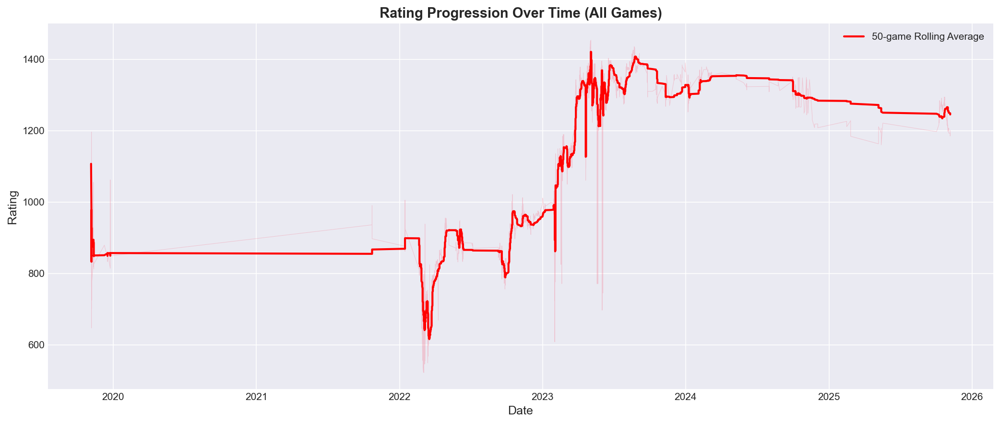
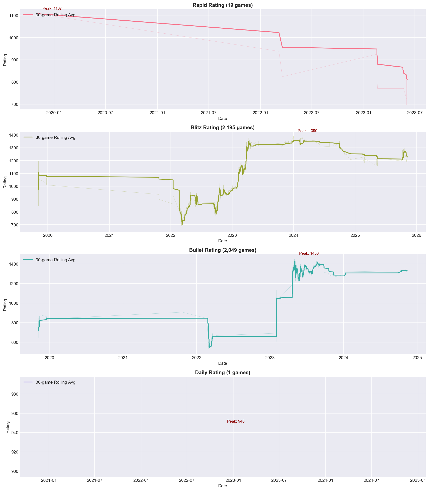
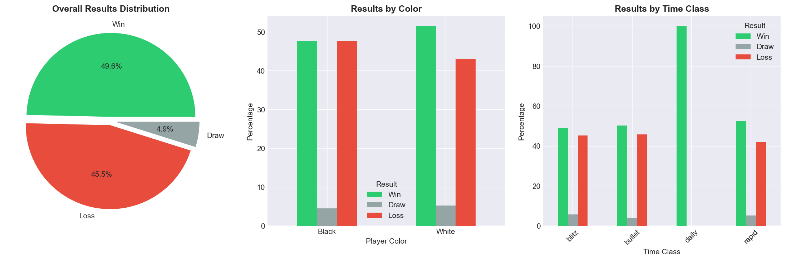
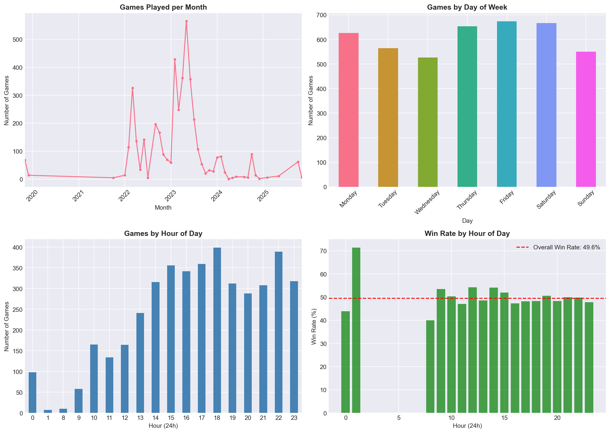
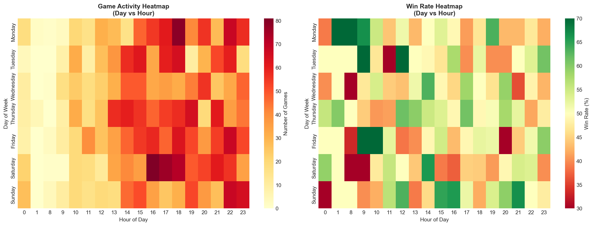
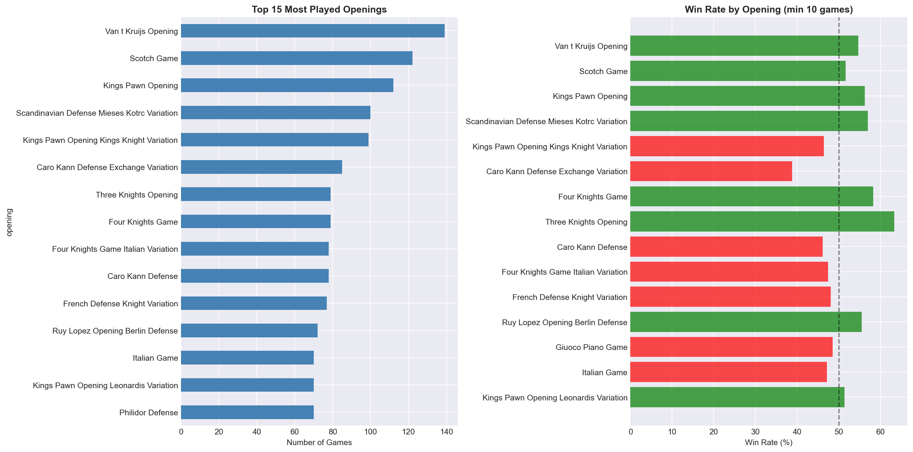
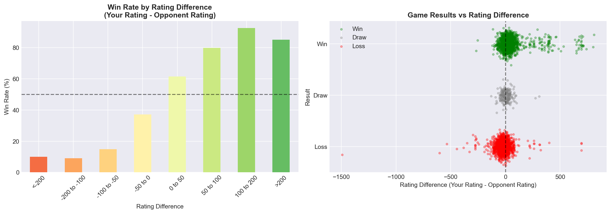
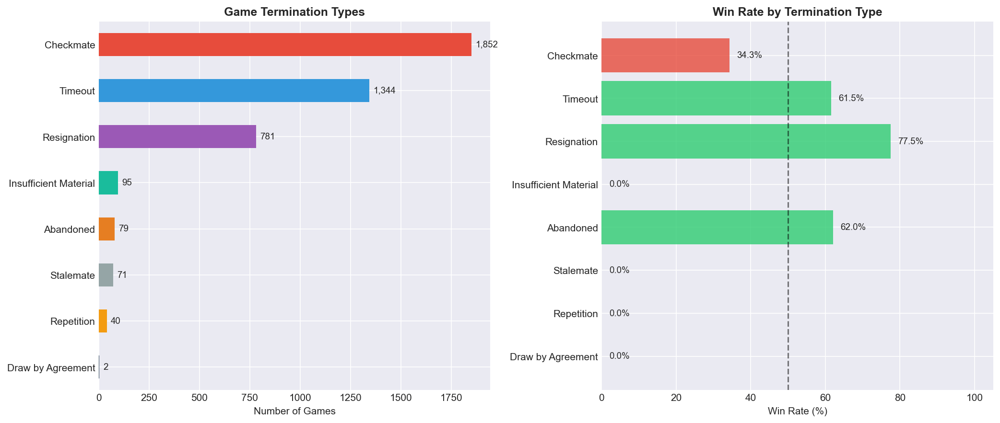
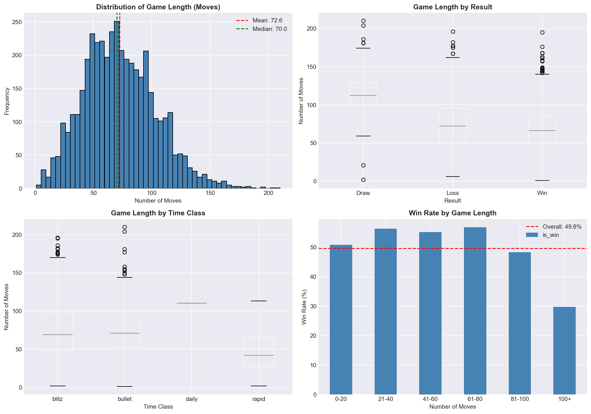

# Chess.com Performance Analysis - Results

**Username:** ramazanyildirimm  
**Analysis Date:** November 27, 2025  
**Total Games Analyzed:** 4,264 games  
**Date Range:** November 6, 2019 - November 6, 2025 (6 years)

---

## Table of Contents

1. [Executive Summary](#executive-summary)
2. [Overall Statistics](#overall-statistics)
3. [Rating Progression](#rating-progression)
4. [Results Distribution](#results-distribution)
5. [Time Pattern Analysis](#time-pattern-analysis)
6. [Opening Analysis](#opening-analysis)
7. [Rating Difference Analysis](#rating-difference-analysis)
8. [Game Termination Analysis](#game-termination-analysis)
9. [Game Length Analysis](#game-length-analysis)
10. [Hypothesis Testing Results](#hypothesis-testing-results)
11. [Key Insights & Recommendations](#key-insights--recommendations)

---

## Executive Summary

This analysis examines 4,264 chess games played on Chess.com over a 6-year period. The data reveals significant improvement in playing strength, with an average rating increase of **+525 points**. Key findings include a statistically significant advantage when playing as White, strong correlation between rating difference and game outcomes, and consistent performance across different time controls.

### Key Metrics at a Glance

| Metric | Value |
|--------|-------|
| Total Games | 4,264 |
| Win Rate | 49.6% |
| Draw Rate | 4.9% |
| Loss Rate | 45.5% |
| Peak Rating | 1,453 |
| Rating Improvement | +525 points |
| Most Played Format | Blitz (51.5%) |

---

## Overall Statistics

### Game Distribution by Time Control

| Time Control | Games | Percentage |
|--------------|-------|------------|
| Blitz | 2,195 | 51.5% |
| Bullet | 2,049 | 48.1% |
| Rapid | 19 | 0.4% |
| Daily | 1 | 0.0% |

### Results Breakdown

| Result | Count | Percentage |
|--------|-------|------------|
| Wins | 2,116 | 49.6% |
| Losses | 1,940 | 45.5% |
| Draws | 208 | 4.9% |

### Performance by Color

| Color | Games | Win Rate |
|-------|-------|----------|
| White | 2,116 | 51.6% |
| Black | 2,148 | 47.7% |

**Finding:** Playing as White provides a statistically significant advantage of **+3.9%** in win rate.

### Rating Statistics

| Metric | Value |
|--------|-------|
| Average Rating | 1,120 |
| Highest Rating | 1,453 |
| Lowest Rating | 522 |
| Average Opponent Rating | 1,110 |
| Average Moves per Game | 72.6 |

---

## Rating Progression

### Overall Rating Over Time

The rating progression shows a clear upward trend over the 6-year period, with the player improving from an initial average of **796** to a recent average of **1,321** - an improvement of **+525 rating points**.

### Rating by Time Class

Current ratings by time control:
- **Bullet:** 1,343
- **Blitz:** 1,201
- **Rapid:** 832

---

## Results Distribution

### Analysis

1. **Overall Results:** Near 50% win rate indicates well-matched opponents (good matchmaking)
2. **Color Impact:** White pieces provide a measurable advantage
3. **Time Control:** Performance is consistent across blitz and bullet formats

---

## Time Pattern Analysis

### Activity Heatmap

### Findings

**Games by Time of Day:**
| Time Period | Games | Win Rate |
|-------------|-------|----------|
| Night (0-6) | 105 | 45.7% |
| Morning (6-12) | 531 | 50.8% |
| Afternoon (12-18) | 2,013 | 49.7% |
| Evening (18-24) | 1,615 | 49.3% |

**Best Performance Day:** Thursday (52.1% win rate)  
**Worst Performance Day:** Saturday (46.9% win rate)

**Note:** Statistical testing showed that time of day and day of week do NOT significantly affect performance (p > 0.05).

---

## Opening Analysis

### Most Played Openings

| Opening | Games | Win Rate |
|---------|-------|----------|
| Van't Kruijs Opening | 139 | - |
| Scotch Game | 122 | - |
| King's Pawn Opening | 112 | - |
| Scandinavian Defense (Mieses-Kotrč) | 100 | - |
| King's Pawn - King's Knight Variation | 99 | - |
| Caro-Kann Defense (Exchange) | 85 | - |
| Three Knights Opening | 79 | - |
| Four Knights Game | 79 | - |
| Four Knights Game (Italian) | 78 | - |
| Caro-Kann Defense | 78 | - |
| French Defense (Knight Variation) | 77 | - |
| Ruy Lopez - Berlin Defense | 72 | - |
| Italian Game | 70 | - |
| King's Pawn - Leonardi's Variation | 70 | - |
| Philidor Defense | 70 | - |

**Total Unique Openings:** 393

The visualization shows the top 15 most frequently played openings and their respective win rates. Openings with win rates above 50% are highlighted in green, while those below 50% are in red.

### Best & Worst Performing Openings (min 20 games)
- **Best:** Nimzowitsch Defense Kennedy Variation (65.0% win rate)
- **Worst:** Italian Game Knight Attack Normal (26.7% win rate)

---

## Rating Difference Analysis

### Win Rate by Rating Difference

| Rating Difference | Win Rate | Games |
|-------------------|----------|-------|
| You're much higher rated (>50) | 82.4% | 612 |
| You're lower rated (<-50) | 14.0% | 492 |

**Key Finding:** Rating difference is the strongest predictor of game outcome. This is statistically significant (p < 0.001).

---

## Game Termination Analysis

### How Games End

| Termination Type | Games | Percentage |
|------------------|-------|------------|
| Checkmate | 1,852 | 43.4% |
| Timeout | 1,344 | 31.5% |
| Resignation | 781 | 18.3% |
| Insufficient Material | 95 | 2.2% |
| Abandoned | 79 | 1.9% |
| Stalemate | 71 | 1.7% |
| Repetition | 40 | 0.9% |

**Key Insights:**
- **Checkmate** is the most common way games end (43.4%)
- **Timeout** is very significant in bullet/blitz games (31.5%)
- Only about 18% of games end by **resignation**

---

## Game Length Analysis

### Key Findings

- **Average Game Length:** 72.6 moves
- **Correlation with Winning:** r = -0.165 (negative correlation)

**Interpretation:** Shorter games are slightly more likely to result in wins. This could indicate:
1. Quick tactical victories
2. Opponent timeouts in faster time controls
3. Decisive play leading to early resignations

---

## Hypothesis Testing Results

Ten statistical hypothesis tests were conducted at significance level α = 0.05.

### Summary

| Category | Count |
|----------|-------|
| Total Tests | 10 |
| Significant Results (p < 0.05) | 4 |
| Non-Significant Results | 6 |

### ✅ Significant Findings (p < 0.05)

| Test | Hypothesis | p-value | Result |
|------|------------|---------|--------|
| **White vs Black Win Rate** | H₀: Win rate as White = Win rate as Black | 0.0121 | **REJECT H₀** |
| **Rating Difference Effect** | H₀: Rating difference doesn't affect win rate | < 0.0001 | **REJECT H₀** |
| **Game Length Correlation** | H₀: No correlation between game length and winning | < 0.0001 | **REJECT H₀** |
| **Rating Progression** | H₀: No significant change in rating over time | < 0.0001 | **REJECT H₀** |

### ❌ Non-Significant Findings (p ≥ 0.05)

| Test | Hypothesis | p-value | Result |
|------|------------|---------|--------|
| **Time Control Effect** | H₀: Win rate is same across time controls | 0.2042 | Fail to reject H₀ |
| **Time of Day Effect** | H₀: Win rate is same regardless of time of day | 0.3630 | Fail to reject H₀ |
| **Day of Week Effect** | H₀: Win rate is same across all days | 0.3505 | Fail to reject H₀ |
| **Opening Effect** | H₀: Win rate is same across openings | 0.2904 | Fail to reject H₀ |
| **Win Rate vs 50%** | H₀: Overall win rate = 50% | 0.6241 | Fail to reject H₀ |
| **Momentum Effect** | H₀: Previous result doesn't affect next game | 0.5127 | Fail to reject H₀ |

### Detailed Test Results

#### Test 1: White vs Black Advantage
- **Test:** Two-Proportion Z-Test
- **Statistic:** z = 2.508
- **p-value:** 0.0121
- **Details:** White Win Rate: 51.56% (n=2,116), Black Win Rate: 47.72% (n=2,148)
- **Conclusion:** There is a statistically significant advantage when playing as White.

#### Test 2: Rating Difference Effect
- **Test:** Two-Proportion Z-Test
- **Statistic:** z = 22.585
- **p-value:** < 0.0001
- **Details:** Win rate when higher rated (>50): 82.35%, Win rate when lower rated (<-50): 14.02%
- **Conclusion:** Rating difference strongly predicts game outcome.

#### Test 3: Time Control Performance
- **Test:** Chi-Square Test
- **Statistic:** χ² = 8.492
- **p-value:** 0.2042
- **Details:** Blitz: 48.9%, Bullet: 50.3%, Rapid: 52.6%
- **Conclusion:** No significant difference in win rate across time controls.

#### Test 4: Time of Day Effect
- **Test:** Chi-Square Test
- **Statistic:** χ² = 6.565
- **p-value:** 0.3630
- **Conclusion:** Performance is consistent throughout the day.

#### Test 5: Day of Week Effect
- **Test:** Chi-Square Test
- **Statistic:** χ² = 13.260
- **p-value:** 0.3505
- **Conclusion:** No significant difference based on day of week.

#### Test 6: Game Length Correlation
- **Test:** Pearson Correlation
- **Statistic:** r = -0.165
- **p-value:** < 0.0001
- **Conclusion:** Shorter games are weakly correlated with winning.

#### Test 7: Rating Progression
- **Test:** Mann-Whitney U Test
- **Statistic:** U = 15.0
- **p-value:** < 0.0001
- **Details:** Early avg: 796, Recent avg: 1,321, Change: +525
- **Conclusion:** Significant improvement in rating over time.

#### Test 8: Opening Effect
- **Test:** Chi-Square Test
- **Statistic:** χ² = 115.62
- **p-value:** 0.2904
- **Best Opening:** Nimzowitsch Defense Kennedy Variation (65.0% win rate)
- **Worst Opening:** Italian Game Knight Attack Normal (26.7% win rate)
- **Conclusion:** No statistically significant difference in win rates across openings (though individual openings show variation)

#### Test 9: Win Rate vs 50%
- **Test:** One-Sample Z-Test
- **Statistic:** z = -0.490
- **p-value:** 0.6241
- **Details:** Actual win rate: 49.62%
- **Conclusion:** Win rate is not significantly different from 50%.

#### Test 10: Momentum Effect
- **Test:** Two-Proportion Z-Test
- **Statistic:** z = 0.655
- **p-value:** 0.5127
- **Details:** Win rate after win: 50.1%, Win rate after loss: 49.1%
- **Conclusion:** No evidence of momentum (winning streaks don't predict next game).

---

## Key Insights & Recommendations

### 🎯 Main Findings

1. **Significant Improvement Over Time**
   - Rating improved by +525 points over 6 years
   - Demonstrates consistent learning and improvement

2. **White Piece Advantage**
   - 3.9% higher win rate as White (statistically significant)
   - Recommendation: Focus on developing strong opening repertoire for both colors

3. **Rating Difference is Key**
   - Win 82% against lower-rated opponents
   - Win only 14% against higher-rated opponents
   - This confirms standard chess rating system accuracy

4. **Consistent Performance**
   - Time of day doesn't affect performance
   - Day of week doesn't affect performance
   - Time control doesn't significantly affect win rate
   - This indicates stable, reliable play regardless of conditions

5. **No Momentum Effect**
   - Winning or losing doesn't predict next game
   - Each game is statistically independent
   - Mental state management may not be a major factor

### 📈 Recommendations for Improvement

1. **Opening Preparation**
   - Analyze openings with lower win rates
   - Develop stronger Black opening repertoire to close the gap

2. **Play More Rated Games**
   - Continue playing to maintain rating progression
   - Consider adding more Rapid games for deeper calculation practice

3. **Analyze Losses**
   - Focus on games lost to lower-rated opponents
   - Identify tactical or positional weaknesses

4. **Time Management**
   - Given negative correlation between game length and winning, work on decisive play
   - Practice converting advantages efficiently

---

## Data Files

| File | Description |
|------|-------------|
| `data/ramazanyildirimm_games.csv` | All game data (4,264 games) |
| `data/ramazanyildirimm_games_full.json` | Full data including PGN moves |
| `data/hypothesis_test_results.csv` | Statistical test results |
| `visualizations/` | All generated plots (9 images) |

---

## Methodology

### Data Collection
- **Source:** Chess.com Public API
- **Endpoints Used:**
  - Player profile: `/pub/player/{username}`
  - Game archives: `/pub/player/{username}/games/{YYYY}/{MM}`
  - Player stats: `/pub/player/{username}/stats`

### Statistical Methods
- **Proportion Tests:** Two-proportion z-test for comparing win rates
- **Independence Tests:** Chi-square test for categorical comparisons
- **Correlation:** Pearson and Spearman correlation coefficients
- **Non-parametric Tests:** Mann-Whitney U for rating progression
- **Significance Level:** α = 0.05 for all tests

### Tools Used
- Python 3.13
- pandas, numpy for data processing
- matplotlib, seaborn for visualization
- scipy, statsmodels for statistical testing
- python-chess for PGN parsing

---

*Analysis performed for DSA 210 - Introduction to Data Science (2025-2026 Fall Term)*