# Chess.com Performance Analysis - Machine Learning Results

**Username:** ramazanyildirimm
**Analysis Date:** December 29, 2025
**Total Games Analyzed:** 4,264 games

---

## Table of Contents

1. [Executive Summary](#executive-summary)
2. [Supervised Learning](#supervised-learning)
   - [Random Forest Classifier](#1-random-forest-classifier)
   - [Decision Tree Classifier](#2-decision-tree-classifier)
   - [K-Nearest Neighbors (KNN)](#3-k-nearest-neighbors-knn)
3. [Unsupervised Learning](#unsupervised-learning)
   - [K-Means Clustering](#4-k-means-clustering)
   - [DBSCAN Clustering](#5-dbscan-clustering)
   - [Principal Component Analysis (PCA)](#6-principal-component-analysis-pca)
4. [Time Series Analysis](#time-series-analysis)
   - [Rating Forecasting (Prophet & ARIMA)](#7-time-series-forecasting)
5. [Model Comparison](#model-comparison)
6. [Key Insights](#key-insights)

---

## Executive Summary

This document presents the results of applying **7 machine learning methods** to analyze chess game data. The analysis covers:

- **Supervised Learning**: Predicting game outcomes (Win/Loss/Draw)
- **Unsupervised Learning**: Discovering hidden patterns and game clusters
- **Time Series Analysis**: Forecasting future rating progression

### Key Findings at a Glance

| Category | Method | Key Result |
|----------|--------|------------|
| Best Classifier | Random Forest | 67.8% accuracy |
| Most Important Feature | Rating Difference | 43.9% importance |
| Optimal Clusters | K-Means (K=3) | Silhouette: 0.335 |
| Rating Forecast | Prophet (6 months) | +59 points |

---

## Supervised Learning

### 1. Random Forest Classifier

**Purpose:** Predict game outcome (Win/Loss/Draw) using ensemble of decision trees.

#### Results

| Metric | Value |
|--------|-------|
| **Accuracy** | 67.76% |
| **CV Mean** | 67.66% (+/- 3.19%) |
| **Best Class** | Win (F1: 0.72) |

#### Classification Report

| Class | Precision | Recall | F1-Score | Support |
|-------|-----------|--------|----------|---------|
| Draw | 0.00 | 0.00 | 0.00 | 42 |
| Loss | 0.68 | 0.65 | 0.66 | 388 |
| Win | 0.68 | 0.77 | 0.72 | 423 |

#### Feature Importance

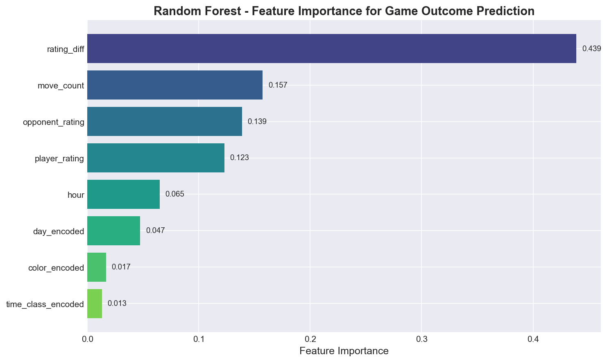

**Top 5 Most Important Features:**

1. **rating_diff**: 43.88% - The difference between player and opponent rating
2. **move_count**: 15.73% - Number of moves in the game
3. **opponent_rating**: 13.88% - Opponent's rating
4. **player_rating**: 12.30% - Player's rating
5. **hour**: 6.48% - Hour of day when game was played

#### Confusion Matrix

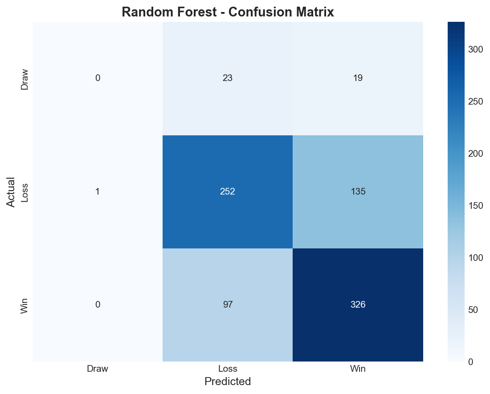

**Interpretation:** Rating difference is by far the most predictive feature, accounting for nearly 44% of the model's predictive power. This confirms that playing against lower-rated opponents significantly increases win probability.

---

### 2. Decision Tree Classifier

**Purpose:** Create interpretable decision rules for predicting game outcomes.

#### Results

| Model | Accuracy | Depth | Leaves |
|-------|----------|-------|--------|
| Full Tree | 58.15% | 29 | 909 |
| **Pruned Tree** | **65.42%** | 5 | 23 |

#### Classification Report (Pruned Tree)

| Class | Precision | Recall | F1-Score | Support |
|-------|-----------|--------|----------|---------|
| Draw | 0.60 | 0.07 | 0.13 | 42 |
| Loss | 0.64 | 0.62 | 0.63 | 388 |
| Win | 0.66 | 0.75 | 0.70 | 423 |

#### Decision Tree Visualization

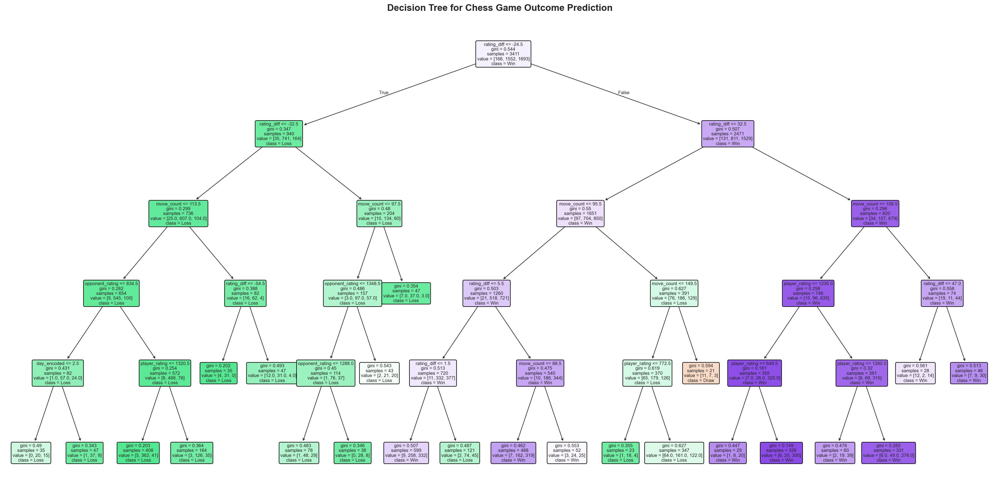

#### Key Decision Rules

```
If rating_diff <= -24.5:
    → Likely LOSS (playing against higher-rated opponent)

If rating_diff > 32.5:
    → Likely WIN (playing against lower-rated opponent)

If -24.5 < rating_diff <= 32.5:
    → Check move_count:
        If move_count > 95.5 and move_count > 149.5:
            → Likely DRAW
        Else:
            → Depends on other factors
```

#### Feature Importance

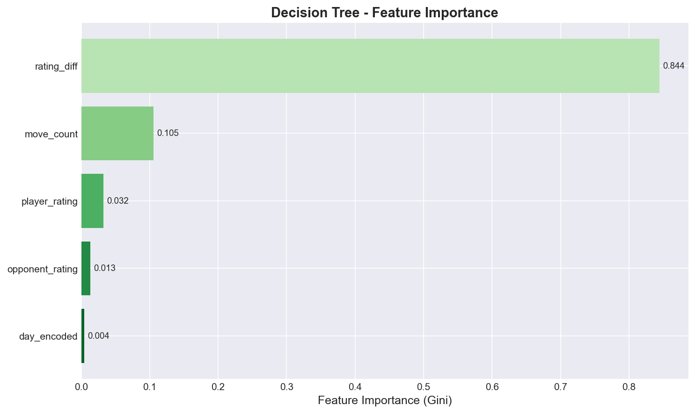

#### Pruning Comparison

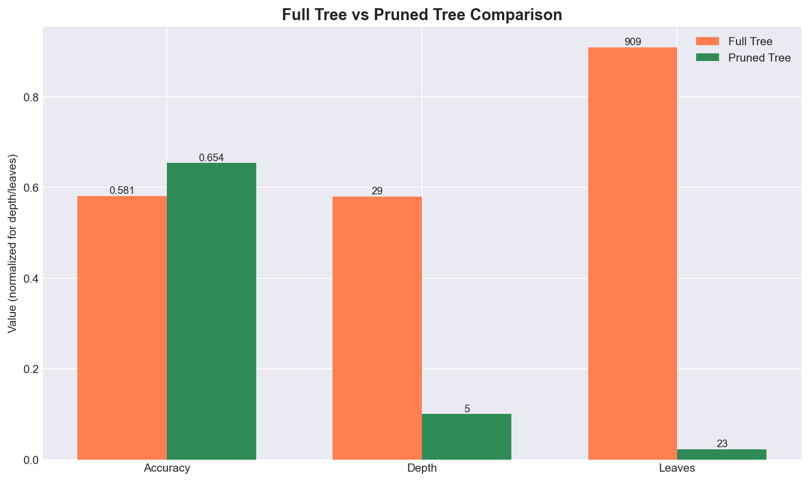

**Interpretation:** Pruning significantly improves the model by reducing overfitting. The pruned tree (depth=5) outperforms the full tree (depth=29) while being much more interpretable.

---

### 3. K-Nearest Neighbors (KNN)

**Purpose:** Classify games based on similarity to nearest neighbors.

#### Results

| Metric | Value |
|--------|-------|
| **Optimal K** | 30 |
| **Accuracy** | 63.77% |
| **CV Mean** | 62.71% (+/- 2.08%) |

#### Distance Metric Comparison

| Metric | Accuracy |
|--------|----------|
| Manhattan | 64.13% |
| Euclidean | 63.77% |
| Minkowski | 63.77% |
| Chebyshev | 61.90% |

#### K Selection Analysis

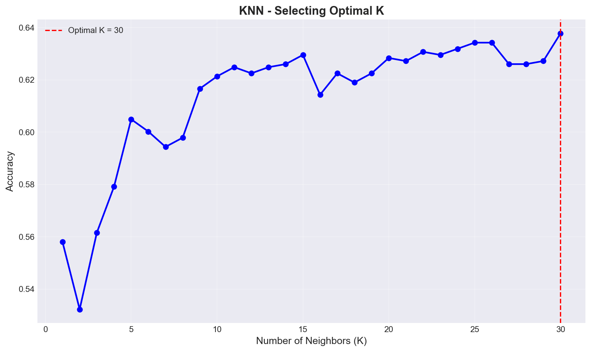

#### Distance Metrics Comparison

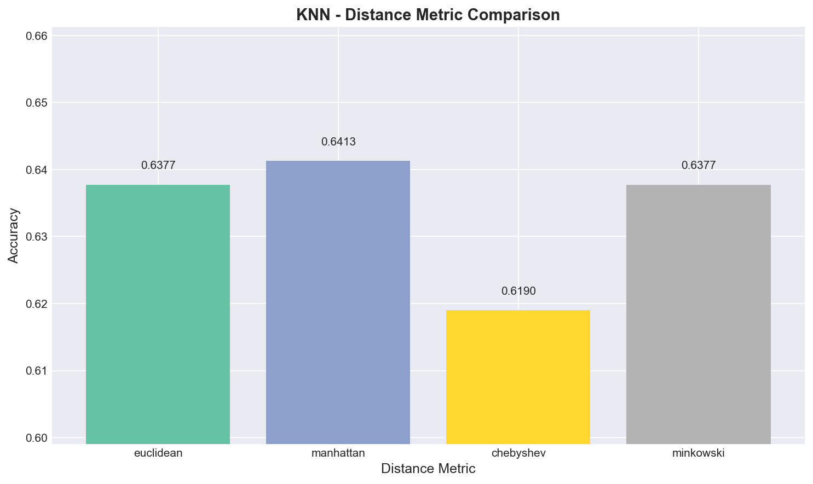

#### Confusion Matrix

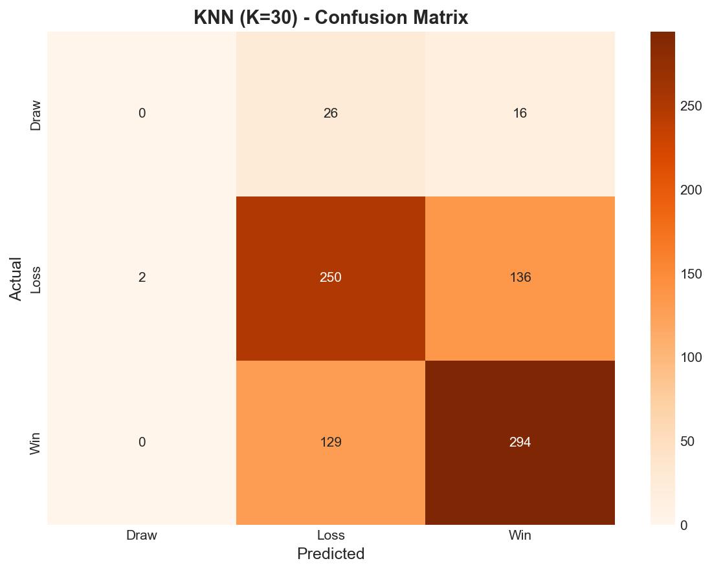

**Interpretation:** KNN achieves lower accuracy than tree-based methods, suggesting that game outcomes are better predicted by decision boundaries than by simple proximity in feature space. Manhattan distance slightly outperforms other metrics.

---

## Unsupervised Learning

### 4. K-Means Clustering

**Purpose:** Discover natural groupings of games based on their characteristics.

#### Results

| Metric | Value |
|--------|-------|
| **Optimal K** | 3 |
| **Silhouette Score** | 0.3354 |
| **Inertia** | 15,288.92 |

#### Cluster Summary

| Cluster | Size | % | Avg Rating Diff | Win Rate | Dominant Format |
|---------|------|---|-----------------|----------|-----------------|
| **0** | 2,231 | 52.3% | -1.4 | 48.5% | Bullet |
| **1** | 1,914 | 44.9% | -2.3 | 48.7% | Blitz |
| **2** | 119 | 2.8% | +423.8 | 84.9% | Blitz |

#### Cluster Interpretation

- **Cluster 0 (Bullet Games):** Majority of games, evenly matched opponents, average win rate
- **Cluster 1 (Blitz Games):** Similar to Cluster 0 but in blitz format
- **Cluster 2 (Easy Wins):** Games against much lower-rated opponents with very high win rate

#### Elbow Method & Silhouette Analysis

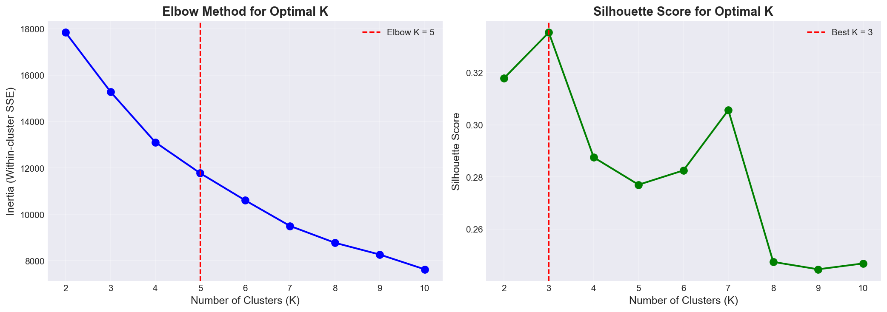

#### Cluster Visualization (PCA Projection)

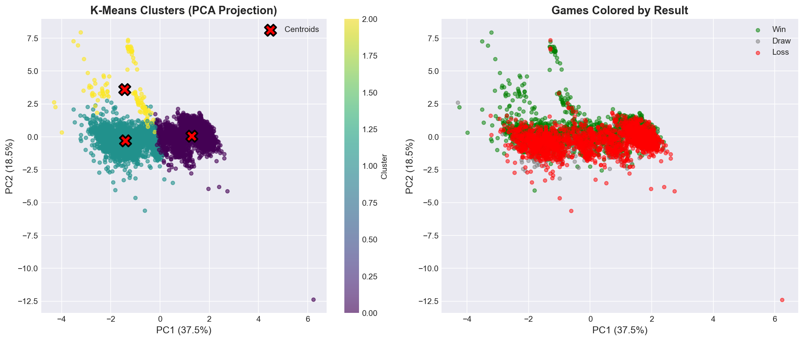

#### Cluster Analysis

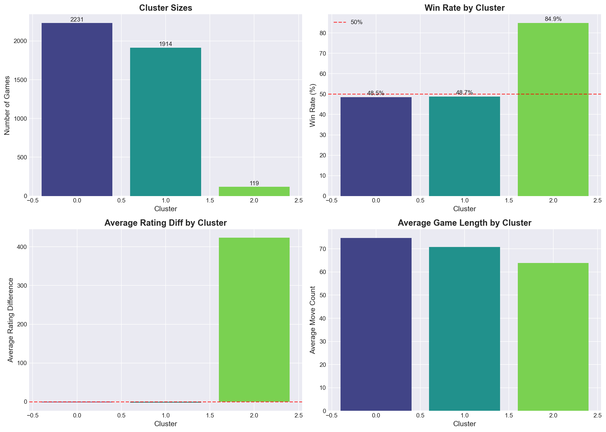

**Interpretation:** The data naturally clusters into 3 groups primarily based on rating difference. Cluster 2 represents "easy games" against much lower-rated opponents with an 85% win rate.

---

### 5. DBSCAN Clustering

**Purpose:** Find density-based clusters and identify outlier games.

#### Results

| Parameter | Value |
|-----------|-------|
| **Epsilon (ε)** | 15.06 |
| **Min Samples** | 10 |
| **Clusters Found** | 1 |
| **Noise Points** | 0 (0.0%) |

#### Cluster Summary

| Cluster | Size | Win Rate | Avg Rating Diff |
|---------|------|----------|-----------------|
| Cluster 0 | 4,264 (100%) | 49.6% | +10.1 |

#### Epsilon Selection (k-Distance Graph)

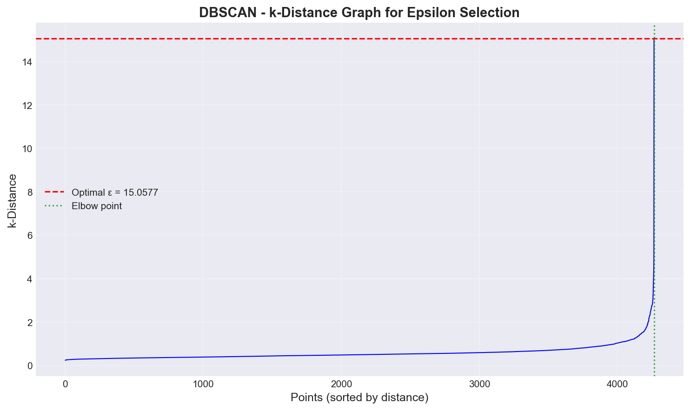

#### Cluster Visualization

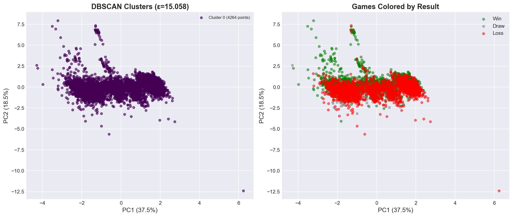

#### Cluster Analysis

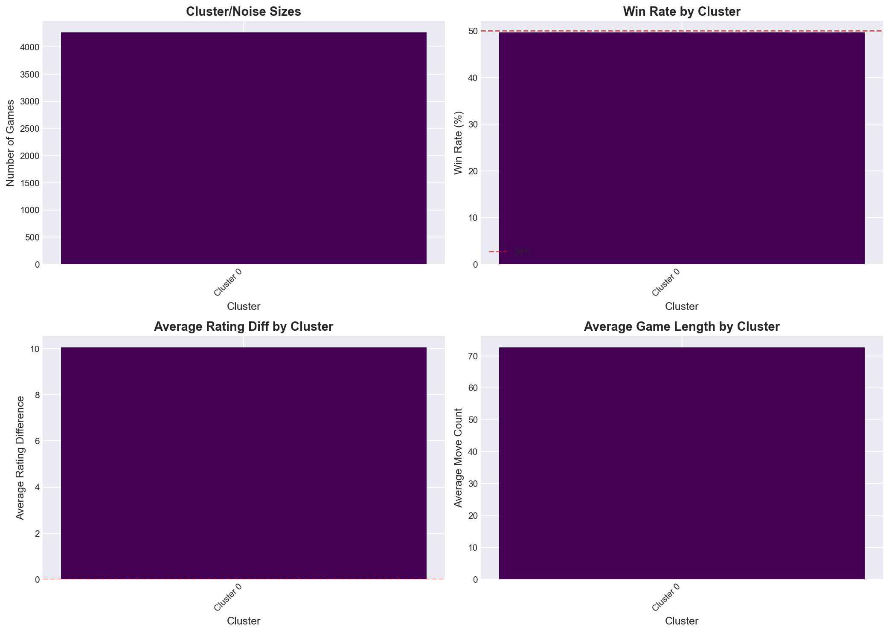

**Interpretation:** DBSCAN finds all games belong to a single dense cluster with no outliers, suggesting the game data is uniformly distributed without clear density-based separation. This contrasts with K-Means which found 3 clusters based on centroid distances.

---

### 6. Principal Component Analysis (PCA)

**Purpose:** Reduce dimensionality and visualize game patterns.

#### Results

| Metric | Value |
|--------|-------|
| **Components for 95% Variance** | 7 |
| **PC1 Variance** | 28.09% |
| **PC2 Variance** | 14.09% |

#### Variance Explained by Component

| Component | Individual | Cumulative |
|-----------|------------|------------|
| PC1 | 28.09% | 28.09% |
| PC2 | 14.09% | 42.18% |
| PC3 | 13.19% | 55.37% |
| PC4 | 12.38% | 67.75% |
| PC5 | 12.27% | 80.02% |
| PC6 | 11.50% | 91.52% |
| PC7 | 8.48% | 100.00% |

#### Top Features per Component

**PC1 (Rating Level):**
- opponent_rating: 0.640
- player_rating: 0.620
- time_encoded: -0.422

**PC2 (Game Competitiveness):**
- rating_diff: 0.666
- move_count: -0.552
- time_encoded: -0.273

#### Explained Variance Plot

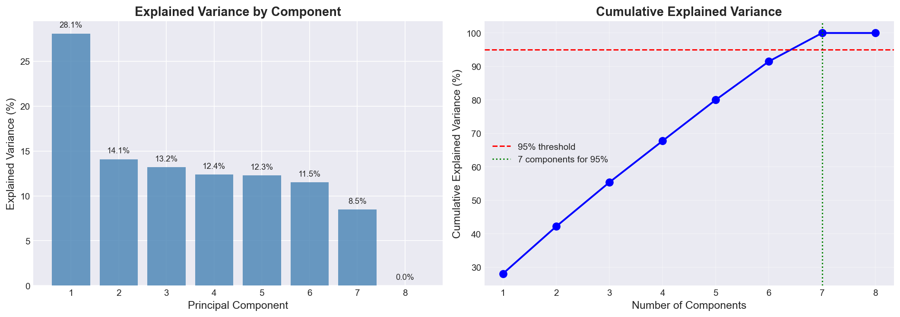

#### 2D Projection

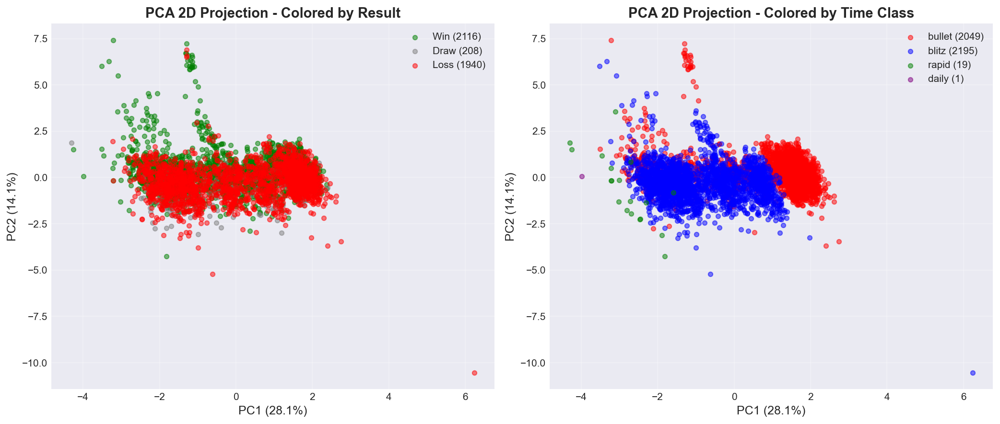

#### 3D Projection

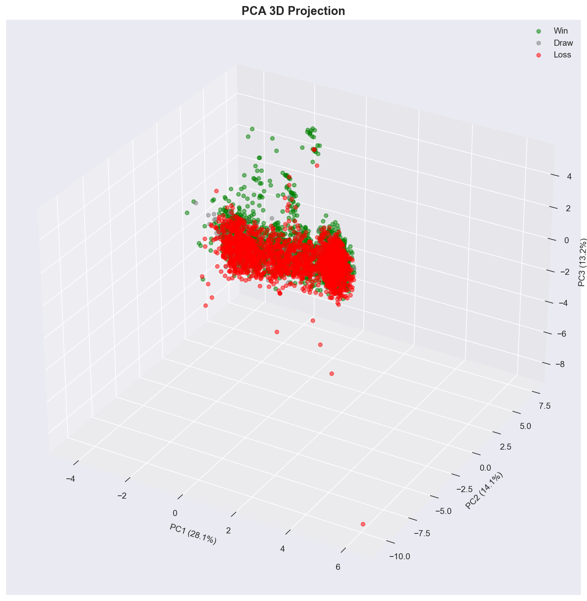

#### Biplot (Features + Data)

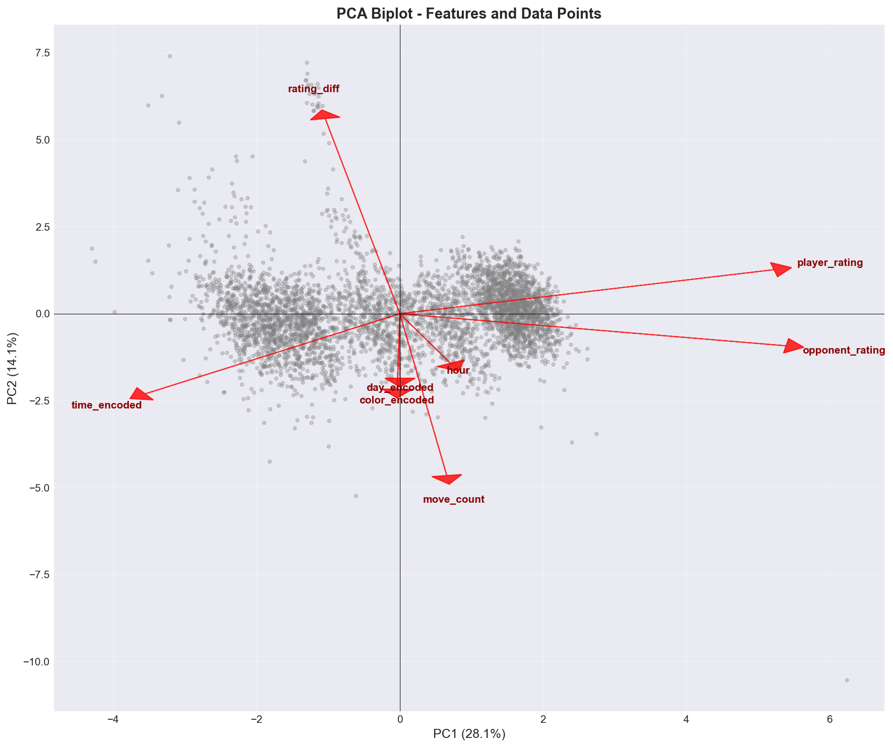

#### Component Loadings Heatmap

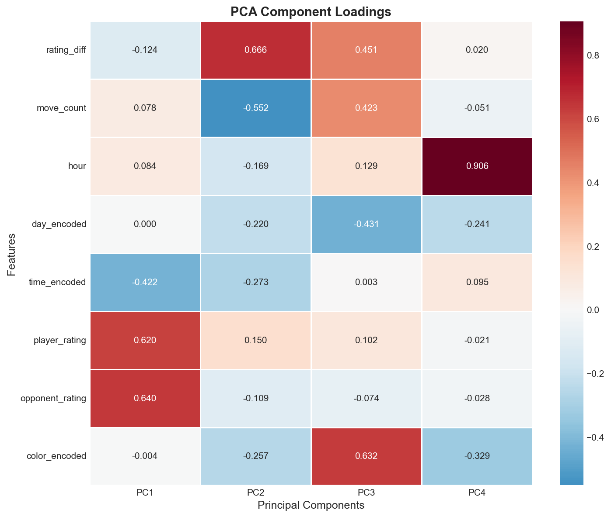

**Interpretation:**
- **PC1** represents the overall rating level (both player and opponent ratings)
- **PC2** captures game competitiveness (rating difference and game length)
- 7 components needed for 95% variance indicates moderate feature redundancy

---

## Time Series Analysis

### 7. Time Series Forecasting

**Purpose:** Forecast future rating using Prophet and ARIMA models.

#### Data Summary

| Metric | Value |
|--------|-------|
| **Date Range** | Nov 2019 - Nov 2025 |
| **Total Weeks** | 123 |
| **Rating Range** | 628 - 1,404 |
| **Current Rating** | 1,193 |

#### Prophet Forecast (6 Months)

| Metric | Value |
|--------|-------|
| **Forecasted Rating** | 1,252 |
| **Expected Change** | **+59 points** |
| **Confidence Interval** | 1,184 - 1,323 |

#### ARIMA Forecast (6 Months)

| Metric | Value |
|--------|-------|
| **Forecasted Rating** | 1,199 |
| **Expected Change** | **+6 points** |
| **Model AIC** | 1,276.28 |
| **Model BIC** | 1,290.30 |

#### Time Series Decomposition

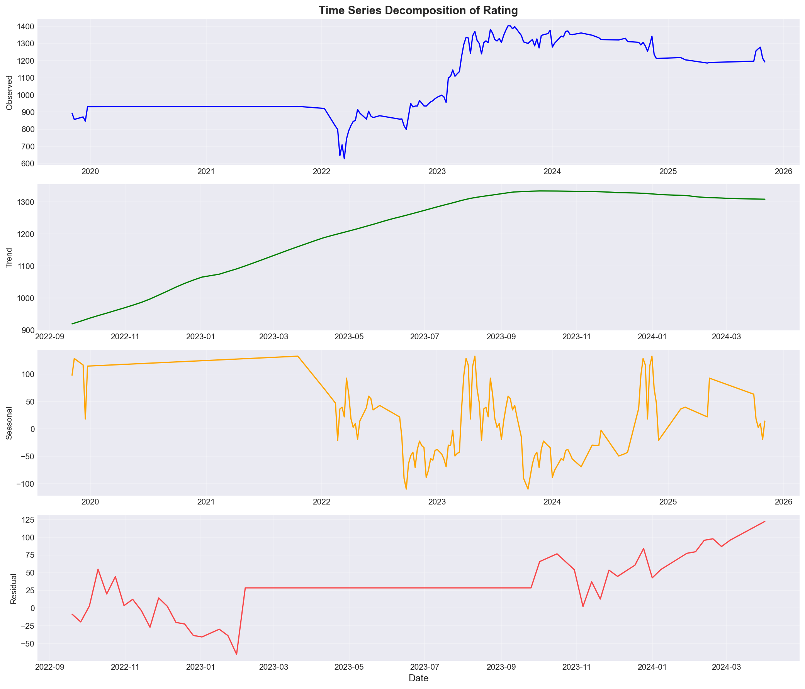

#### Prophet Forecast

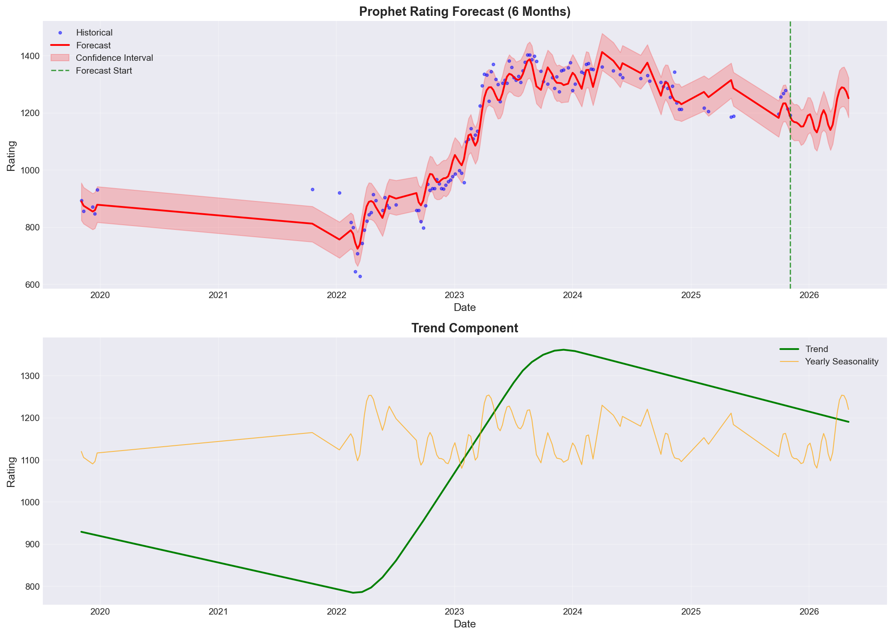

#### ARIMA Forecast

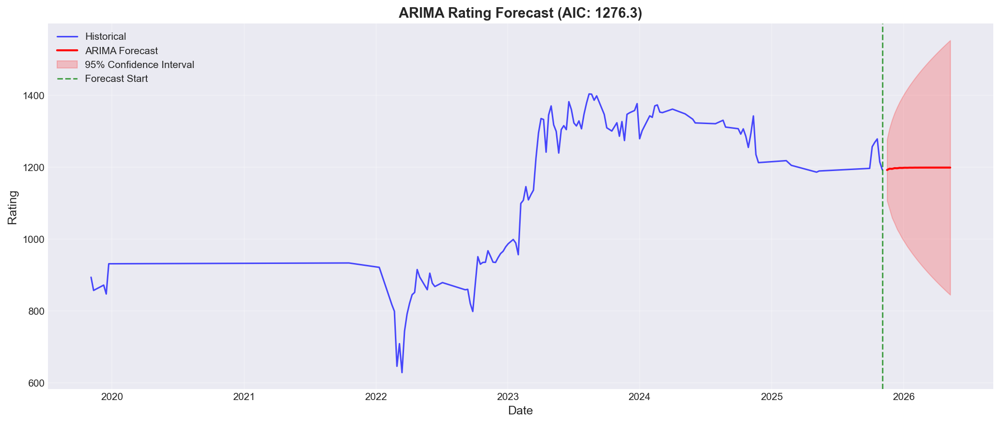

#### Forecast Comparison

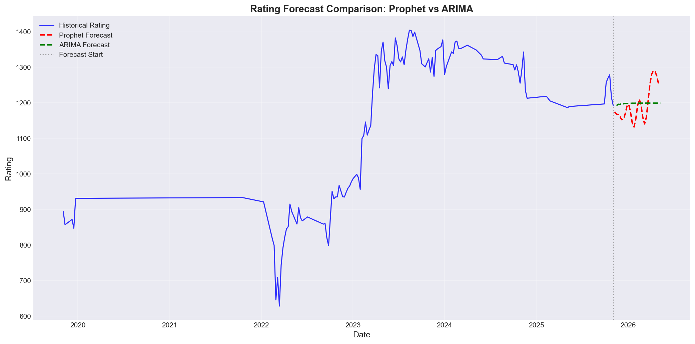

**Interpretation:**
- **Prophet** predicts more optimistic growth (+59 points) by capturing long-term trend
- **ARIMA** is more conservative (+6 points), focusing on recent patterns
- Both models agree rating will continue to improve
- Prophet's wider confidence interval reflects more uncertainty in long-term predictions

---

## Model Comparison

### Supervised Learning Comparison

| Model | Accuracy | CV Mean | Best For |
|-------|----------|---------|----------|
| **Random Forest** | **67.76%** | **67.66%** | Best overall accuracy |
| Decision Tree | 65.42% | 65.31% | Interpretability |
| KNN | 63.77% | 62.71% | Simple baseline |

### Unsupervised Learning Comparison

| Model | Clusters | Silhouette | Best For |
|-------|----------|------------|----------|
| **K-Means** | 3 | **0.335** | Clear cluster separation |
| DBSCAN | 1 | N/A | Density-based analysis |

### Key Observations

1. **Random Forest wins** for prediction accuracy
2. **Decision Tree** provides best interpretability with clear rules
3. **K-Means** successfully identified 3 distinct game patterns
4. **PCA** shows rating-related features dominate the variance
5. **Prophet** gives more optimistic but realistic long-term forecasts

---

## Key Insights

### 1. Rating Difference is King
The most important predictor of game outcome is the rating difference between you and your opponent (43.9% importance in Random Forest).

### 2. Three Types of Games
K-Means clustering revealed three distinct game patterns:
- Regular bullet games (52%)
- Regular blitz games (45%)
- Easy wins against lower-rated players (3%)

### 3. Draws are Hard to Predict
All models struggle to predict draws (only 4.9% of games), with near-zero recall. This is expected given draws are rare and often result from specific game situations.

### 4. Continued Improvement Expected
Both Prophet and ARIMA forecast continued rating improvement over the next 6 months, with Prophet predicting a more substantial gain of +59 points.

### 5. Decision Rules for Winning
From Decision Tree analysis:
- Play against lower-rated opponents (rating_diff > 32) → 75%+ win rate
- Avoid higher-rated opponents (rating_diff < -25) → high loss probability
- Very long games (150+ moves) often end in draws

---

## Visualizations Summary

All visualizations are saved in `visualizations/ml/`:

| File | Description |
|------|-------------|
| `rf_feature_importance.png` | Random Forest feature importance |
| `rf_confusion_matrix.png` | Random Forest confusion matrix |
| `dt_tree_visualization.png` | Decision Tree structure |
| `dt_feature_importance.png` | Decision Tree feature importance |
| `dt_confusion_matrix.png` | Decision Tree confusion matrix |
| `dt_pruning_comparison.png` | Full vs Pruned tree comparison |
| `knn_k_selection.png` | Optimal K selection |
| `knn_distance_metrics.png` | Distance metric comparison |
| `knn_confusion_matrix.png` | KNN confusion matrix |
| `kmeans_elbow_silhouette.png` | K-Means optimization |
| `kmeans_clusters.png` | K-Means cluster visualization |
| `kmeans_cluster_analysis.png` | Cluster characteristics |
| `dbscan_eps_selection.png` | DBSCAN epsilon selection |
| `dbscan_clusters.png` | DBSCAN cluster visualization |
| `dbscan_cluster_analysis.png` | DBSCAN analysis |
| `pca_explained_variance.png` | PCA variance explained |
| `pca_2d_projection.png` | 2D PCA projection |
| `pca_3d_projection.png` | 3D PCA projection |
| `pca_biplot.png` | PCA biplot |
| `pca_loadings_heatmap.png` | Component loadings |
| `ts_decomposition.png` | Time series decomposition |
| `ts_prophet_forecast.png` | Prophet forecast |
| `ts_arima_forecast.png` | ARIMA forecast |
| `ts_forecast_comparison.png` | Forecast comparison |

---

## How to Reproduce

Run the ML analysis using:

```bash
python3 main.py
# Select option [4] for ML Analysis
```

Or run all analyses:

```bash
python3 main.py
# Select option [5] for Complete Pipeline
```

---

*Machine Learning Analysis performed for DSA 210 - Introduction to Data Science (2025-2026 Fall Term)*
